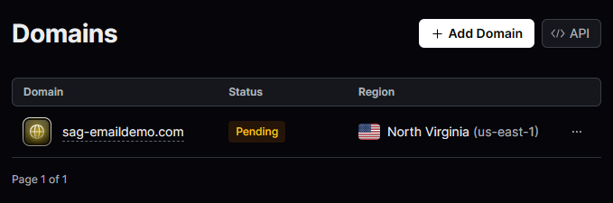
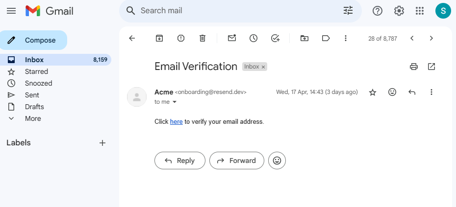

Netlify link of the deployed app: 

I managed to upload the cloudinary in profile creation using widgets, and location and email data is stored seperately inside the mongoDb database. 

The Resend api was correctly implemented and a verification message with a time period has also been set-up. But resend is not functional because it needed a cutom-domain and some configurations in order to send the email to users other than my email. But a verification email does get sent to my address.
Custom domain i made is still pending for verification, maybe i need to buy one domain

